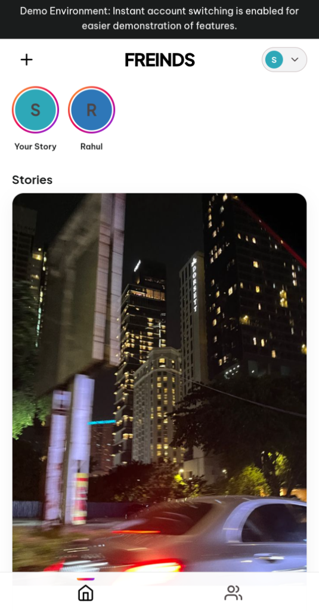
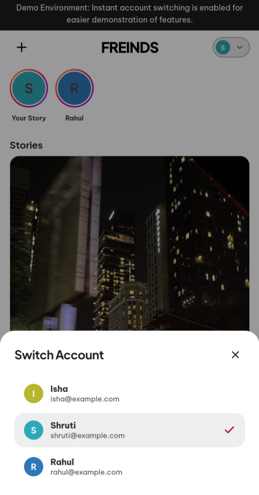
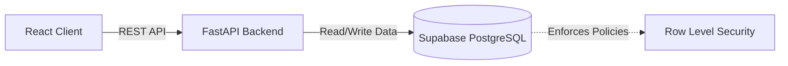
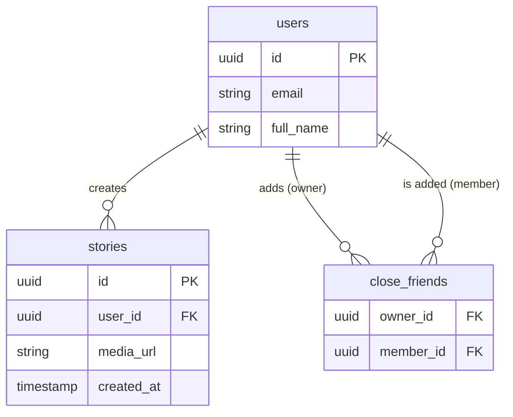

# Close Friends: RLS Data Isolation

A full-stack Instagram-style feed demonstrating secure Row Level Security (RLS) and data isolation with Supabase.

<div align="center">
  <p><b>Live Demo:</b> <a href="https://freinds-app.vercel.app/">https://freinds-app.vercel.app/</a></p>
</div>

## Overview

The core problem solved by this project is not the UI, but enforcing complex data visibility rules securely. Specifically, it implements the "Close Friends" feature: a user should only be able to see a story if the creator explicitly added them to their Close Friends list. 

Instead of writing complex, error-prone filtering logic in the backend application layer, this project pushes authorization logic entirely down to the database layer using **Supabase Row Level Security (RLS)**. It also features a custom-built, zero-friction 1-click test environment allowing evaluators to instantly switch accounts and test the visibility rules without creating fake credentials.

## Screenshots

<div align="center">
  
  &nbsp; &nbsp; &nbsp;
  
  &nbsp; &nbsp; &nbsp;
  
</div>

## Tech Stack

| Layer | Technology |
|---|---|
| **Backend** | Python, FastAPI |
| **Database** | PostgreSQL (Supabase) |
| **Security** | Supabase Row Level Security (RLS) |
| **Frontend** | React, Vite |
| **Deployment** | Render (API), Vercel (Frontend) |

## Architecture

Data flows from the React client to a FastAPI backend, which relies on Supabase to enforce data access policies before returning data.



## Database Schema & RLS

The database relies on a junction table (`close_friends`) to determine visibility. The Supabase RLS policies are written so that when the `stories` table is queried, the database automatically filters out any stories the requesting user is not authorized to see.



## Design Decisions

- **Thick Database, Thin Backend:** Chosen to prevent data leaks. By writing RLS policies directly in PostgreSQL, it is mathematically impossible for the FastAPI backend to accidentally serve a private story to the wrong user, even if an API endpoint is poorly written.
- **The "Zero-Friction" Demo Architecture:** Evaluators drop off if they have to register accounts. I built a custom "1-click account switcher" UI and bypassed standard JWT auth on the client to allow recruiters to instantly switch perspectives and test the RLS rules.
- **Deterministic Database Seeding:** The backend includes an `admin_setup.py` script that uses the Supabase Service Role key to seed the database with a deterministic, pre-configured web of users and close-friend relationships so the demo is perfectly testable right out of the box.

## Tradeoffs & Future Improvements

- **Limitation:** To enable the 1-Click Demo Mode, strict JWT validation on the backend was bypassed in favor of an assumed-identity model via headers.
- **Improvement:** In a production commercial release, I would enforce Supabase Auth JWTs on every API request and remove the account switcher.
- **Limitation:** Media upload latency can be high because the free-tier Render backend (Ohio) handles the upload stream while the client is in India.
- **Improvement:** Move media uploads directly from the Client to Supabase Storage via signed URLs to utilize edge caching and reduce backend CPU load.

## Local Setup

**1. Clone the repository**
```bash
git clone https://github.com/sarthak-shubham/freinds-app.git
cd freinds-app
```

**2. Backend Setup**
```bash
cd backend
python -m venv venv
source venv/bin/activate  # Or `venv\Scripts\activate` on Windows
pip install -r requirements.txt
```

**3. Environment Variables**
Create a `.env` file in the `backend` directory:
| Variable | Description |
|---|---|
| `SUPABASE_URL` | Your Supabase project URL |
| `SUPABASE_KEY` | Supabase Anon/Public key |
| `SUPABASE_SERVICE_ROLE_KEY` | Needed for `admin_setup.py` |

**4. Seed the Database**
```bash
python scripts/admin_setup.py
```

**5. Run the Application**
Start the backend (from `backend` folder):
```bash
uvicorn main:app --reload
```
Start the frontend (from `frontend` folder in a new terminal):
```bash
npm install
npm run dev
```
